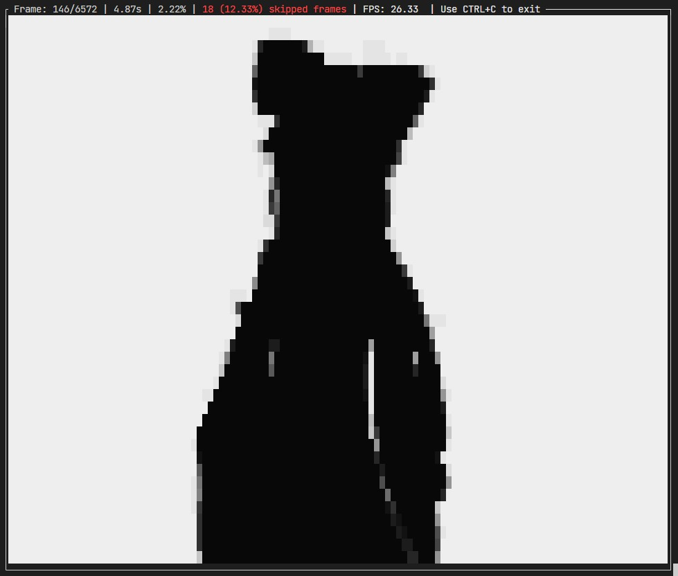

# Terminal-Video-Player
 

 This was a school project, the code is not clean, nor is it efficient. I have no intention of maintaining the codebase, but it is simple enough it should not be a problem.
 
 # Usage
 
 Place a video file in the same folder as these files, then run main.py, and type the filename.
